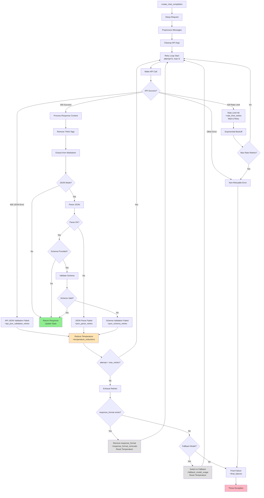

# Elelem

Elelem is a unified API wrapper for OpenAI, GROQ, DeepInfra, and Scaleway APIs, specifically designed for JSON output generation with comprehensive cost tracking, retry logic, and error handling. It provides a fully OpenAI-compatible response format, making it a drop-in replacement for the OpenAI Python SDK.

## Features

- 🔧 **Unified Interface**: Single API for OpenAI, GROQ, DeepInfra, and Scaleway models
- 🎯 **OpenAI Compatible**: Drop-in replacement with identical response format
- 💰 **Cost Tracking**: Precise token and cost tracking with tag-based categorization
- 🔄 **Retry Logic**: Automatic JSON validation and retry with temperature adjustment
- 🛡️ **JSON Schema Validation**: Automatic validation with detailed error reporting and retries
- 📊 **Retry Analytics**: Comprehensive tracking of retry events and failure patterns
- ⚡ **Rate Limit Handling**: Exponential backoff for rate limit errors
- 🛡️ **Error Handling**: Graceful handling of API errors and fallbacks
- 🧠 **Think Tag Removal**: Automatic removal of reasoning model think tags
- 🎯 **Provider-Specific Handling**: Auto-removes unsupported parameters per provider

## Installation

### Local Development
```bash
pip install -e /path/to/Elelem/
```

### From Git Repository
```bash
pip install git+https://github.com/yourorg/elelem.git
```

### From Private PyPI
```bash
pip install elelem --index-url https://your-private-pypi.com
```

## Quick Start

```python
import asyncio
from elelem import Elelem

async def main():
    # Initialize Elelem
    elelem = Elelem()
    
    # Make a chat completion request
    response = await elelem.create_chat_completion(
        messages=[
            {"role": "system", "content": "You are a helpful assistant."},
            {"role": "user", "content": "Generate a JSON object with sample data."}
        ],
        model="scaleway:gemma-3-27b-it",  # or "openai:gpt-4.1-mini"
        response_format={"type": "json_object"},
        tags=["example"]
    )
    
    # Access response content (OpenAI-compatible format)
    content = response.choices[0].message.content
    print(content)
    
    # Get usage statistics
    stats = elelem.get_stats()
    print(f"Total cost: ${stats['total_cost_usd']:.4f}")
    
    # Get statistics by tag
    tag_stats = elelem.get_stats_by_tag("example")
    print(f"Example tag cost: ${tag_stats['total_cost_usd']:.4f}")

if __name__ == "__main__":
    asyncio.run(main())
```

## Configuration

Set up your API keys as environment variables:

```bash
export OPENAI_API_KEY="your-openai-key"
export GROQ_API_KEY="your-groq-key"
export DEEPINFRA_API_KEY="your-deepinfra-key"
export SCALEWAY_API_KEY="your-scaleway-key"
```

## JSON Schema Validation

Elelem supports automatic JSON schema validation to ensure LLM responses match your expected structure. Simply pass a `json_schema` parameter (JSON Schema draft-07) along with `response_format={"type": "json_object"}`:

```python
response = await elelem.create_chat_completion(
    messages=[{"role": "user", "content": "Generate user data"}],
    model="groq:openai/gpt-oss-20b",
    response_format={"type": "json_object"},
    json_schema=your_schema_dict,  # Your JSON Schema definition
    temperature=1.5
)
```

**Benefits:**
- **Guaranteed Structure**: Response will match your schema or fail gracefully
- **Automatic Retries**: On validation failure, temperature is reduced and request retried
- **Detailed Error Logging**: Shows exactly what failed (missing fields, wrong types, invalid values)
- **Production Ready**: Handles edge cases like malformed JSON, API rejections, and timeouts

### Request Flow (State Machine)



**State Descriptions:**
- **🟢 Green**: Success paths that return valid responses
- **🟡 Yellow**: Retry triggers that reduce temperature and loop back
- **🔴 Red**: Final failure after all strategies exhausted
- **⚫ Gray**: Fallback strategies (format removal, model switching)

**Key Retry Analytics Tracking:**
- Each retry type increments specific counters
- Temperature reductions happen on all JSON/schema failures
- Fallback strategies are last resort before final failure
- All events contribute to `total_retries` counter

## Retry Analytics

Elelem tracks detailed metrics on retry events and failure patterns:

```python
stats = elelem.get_stats_by_tag("your_tag")
retry_analytics = stats["retry_analytics"]

# Available metrics:
retry_analytics["json_parse_retries"]           # Malformed JSON syntax
retry_analytics["json_schema_retries"]          # Valid JSON, wrong structure  
retry_analytics["api_json_validation_retries"]  # Provider rejected request
retry_analytics["rate_limit_retries"]           # Rate limit backoff events
retry_analytics["temperature_reductions"]       # Temperature adjustment events
retry_analytics["response_format_removals"]     # Fallback strategy usage
retry_analytics["fallback_model_usage"]         # Alternative model attempts
retry_analytics["final_failures"]              # Requests that never succeeded
retry_analytics["total_retries"]               # Sum of all retry events
```

**Use Cases**: Production monitoring, cost optimization, model selection, temperature tuning

## Supported Models

### OpenAI Models
- `openai:gpt-4.1` - Latest GPT-4.1 model
- `openai:gpt-4.1-mini` - Cost-effective GPT-4.1 variant
- `openai:gpt-5` - GPT-5 model (when available)
- `openai:gpt-5-mini` - Cost-effective GPT-5 variant
- `openai:o3` - Reasoning model (no temperature support)
- `openai:o3-mini` - Cost-effective reasoning model

### GROQ Models
- `groq:openai/gpt-oss-120b` - Large open-source GPT model
- `groq:openai/gpt-oss-20b` - Medium open-source GPT model
- `groq:moonshotai/kimi-k2-instruct` - Kimi K2 instruction model
- `groq:meta-llama/llama-4-maverick-17b-128e-instruct` - Llama 4 Maverick
- `groq:meta-llama/llama-4-scout-17b-16e-instruct` - Llama 4 Scout

### DeepInfra Models
- `deepinfra:openai/gpt-oss-120b` - GPT OSS 120B via DeepInfra
- `deepinfra:openai/gpt-oss-20b` - GPT OSS 20B via DeepInfra
- `deepinfra:meta-llama/Llama-4-Maverick-17B-128E-Instruct-FP8` - Llama 4 Maverick FP8
- `deepinfra:meta-llama/Llama-4-Scout-17B-16E-Instruct` - Llama 4 Scout
- `deepinfra:moonshotai/Kimi-K2-Instruct` - Kimi K2 via DeepInfra
- `deepinfra:deepseek-ai/DeepSeek-R1-0528` - DeepSeek reasoning model

### Scaleway Models
- `scaleway:gpt-oss-120b` - Large open-source GPT model (€0.15/€0.60 per 1M tokens)
- `scaleway:gemma-3-27b-it` - Google Gemma 3 27B instruct model (€0.25/€0.50 per 1M tokens)
- `scaleway:mistral-small-3.2-24b-instruct-2506` - Mistral Small 3.2 24B (€0.15/€0.35 per 1M tokens)
- `scaleway:qwen3-235b-a22b-instruct-2507` - Qwen 3 235B instruct model (€0.75/€2.25 per 1M tokens)

**Note:** Scaleway models are hosted in European data centers with competitive EUR pricing. Prices shown are converted to USD at ~1.07 rate for cost tracking.

## API Reference

### Main Methods

#### `create_chat_completion(messages, model, tags=[], **kwargs)`

Creates a chat completion with the specified model.

**Parameters:**
- `messages` (List[Dict]): List of message dictionaries
- `model` (str): Model string in "provider:model" format
- `tags` (Union[str, List[str]]): Tags for cost tracking
- `**kwargs`: Additional OpenAI API parameters

**Returns:**
- OpenAI-compatible response with `choices[0]["message"]["content"]` access

#### `get_stats()`

Returns overall usage statistics.

**Returns:**
- Dictionary with token counts, costs, call counts, and timing information

#### `get_stats_by_tag(tag)`

Returns usage statistics filtered by a specific tag.

**Parameters:**
- `tag` (str): Tag to filter statistics by

**Returns:**
- Dictionary with tag-specific statistics

#### `list_models()`

Returns all available models in OpenAI-compatible format.

**Returns:**
- Dictionary with `object: "list"` and `data` array containing model information
- Each model includes `id`, `object`, `created`, `owned_by`, and `available` fields
- `available` field indicates whether the provider's API key is configured

## Special Features

### JSON Mode Handling
When `response_format={"type": "json_object"}` is specified:
- Automatic JSON instructions are added to the prompt
- DeepInfra models automatically have `response_format` removed (not supported)
- JSON validation with automatic retry on parse errors
- Temperature reduction on retry attempts

### Think Tag Removal
Reasoning models (like DeepSeek-R1) often include `<think>...</think>` tags:
- Automatically detected and removed from all responses
- Preserves the actual response content
- Works with multiline think blocks

### Cost Tracking
Precise cost calculation based on actual token usage:
- Input, output, and reasoning token tracking
- Per-model pricing from built-in cost database
- Tag-based categorization for project tracking
- Cumulative statistics across all requests

### Rate Limit Handling
Automatic retry with exponential backoff:
- Detects 429 (Too Many Requests) errors
- Configurable backoff intervals: [1, 2, 4, 8] seconds
- Maximum retry attempts: 4 (configurable)
- Preserves request parameters across retries

## Development

### Running Tests
```bash
# Install development dependencies
pip install -e ".[dev]"

# Run tests
pytest

# Run tests with coverage
pytest --cov=elelem --cov-report=html
```

### Code Quality
```bash
# Format code
black src/ tests/

# Sort imports
isort src/ tests/

# Lint code
flake8 src/ tests/

# Type checking
mypy src/
```

## Architecture

Elelem follows a modular architecture:

- **elelem.py**: Main Elelem class with unified API and provider client creation
- **models.yaml**: Model definitions with capabilities, pricing, and provider configurations
- **config.py**: Configuration management
- **config.json**: Default configuration settings

### Backwards Compatibility
- All existing API calls work without modification
- Statistics structure matches exactly
- Response format is OpenAI-compatible
- Error handling is graceful and consistent

## License

MIT License - see LICENSE file for details.

## Contributing

1. Fork the repository
2. Create a feature branch
3. Make your changes
4. Add tests for new functionality
5. Run the test suite
6. Submit a pull request

## Support

For issues and questions:
- Check the [documentation](SPECIFICATION.md)
- Review existing [issues](https://github.com/yourorg/elelem/issues)
- Submit a [new issue](https://github.com/yourorg/elelem/issues/new)