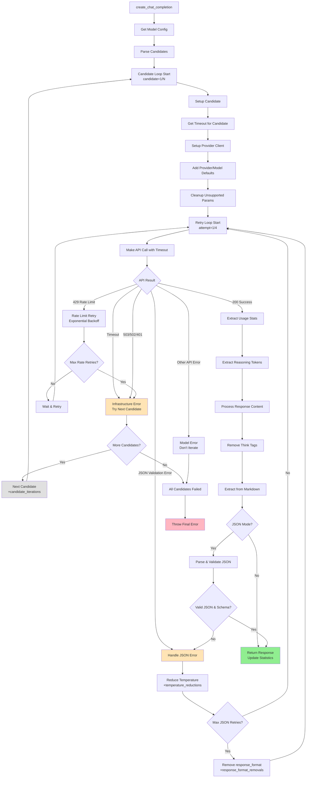

# Elelem

Elelem is a unified API wrapper for multiple AI providers (OpenAI, GROQ, DeepInfra, Scaleway, Fireworks, OpenRouter, Parasail), designed for production use with comprehensive cost tracking, reasoning token analytics, and advanced fallback strategies. It provides a fully OpenAI-compatible response format, making it a drop-in replacement for the OpenAI Python SDK.

## Features

- 🔧 **Unified Interface**: Single API for 8+ providers with 47+ models
- 🎯 **OpenAI Compatible**: Drop-in replacement with identical response format
- 🧠 **Reasoning Token Analytics**: Dual token rates for reasoning models (total vs actual output speed)
- 🔄 **Virtual Models & Candidate System**: Automatic fallback across providers with timeout handling
- 💰 **Cost Tracking**: Precise token and cost tracking with tag-based categorization
- 📊 **Rich Metadata System**: Model display names, owners, reasoning capabilities, licenses
- 🛡️ **JSON Schema Validation**: Automatic validation with detailed error reporting and retries
- 📊 **Retry Analytics**: Comprehensive tracking of retry events and failure patterns
- ⚡ **Rate Limit Handling**: Exponential backoff for rate limit errors
- 🛡️ **Error Handling**: Graceful handling of API errors and infrastructure failures
- 🧠 **Thinking Mode Support**: DeepSeek thinking mode with `<think>` tag extraction
- 🎯 **Provider-Specific Handling**: Auto-removes unsupported parameters per provider
- 🔄 **YAML Configuration System**: Provider-specific files with centralized metadata
- 📈 **Telelem Batch Testing**: Comprehensive benchmarking tool with dashboard-ready JSON output

## Installation

### Local Development
```bash
pip install -e /path/to/Elelem/
```

### From Git Repository
```bash
pip install git+https://github.com/yourorg/elelem.git
```

### From Private PyPI
```bash
pip install elelem --index-url https://your-private-pypi.com
```

## Quick Start

```python
import asyncio
from elelem import Elelem

async def main():
    # Initialize Elelem
    elelem = Elelem()
    
    # Make a chat completion request
    response = await elelem.create_chat_completion(
        messages=[
            {"role": "system", "content": "You are a helpful assistant."},
            {"role": "user", "content": "Generate a JSON object with sample data."}
        ],
        model="scaleway:gpt-oss-120b",  # or "virtual:gpt-oss-120b" for multi-provider fallback
        response_format={"type": "json_object"},
        tags=["example"]
    )
    
    # Access response content (OpenAI-compatible format)
    content = response.choices[0].message.content
    print(content)
    
    # Get usage statistics
    stats = elelem.get_stats()
    print(f"Total cost: ${stats['total_cost_usd']:.4f}")
    print(f"Reasoning tokens: {stats['reasoning_tokens']}")
    
    # Get statistics by tag
    tag_stats = elelem.get_stats_by_tag("example")
    print(f"Example tag cost: ${tag_stats['total_cost_usd']:.4f}")

if __name__ == "__main__":
    asyncio.run(main())
```

## Configuration

Set up your API keys as environment variables:

```bash
export OPENAI_API_KEY="your-openai-key"
export GROQ_API_KEY="your-groq-key" 
export DEEPINFRA_API_KEY="your-deepinfra-key"
export SCALEWAY_ACCESS_KEY="your-scaleway-access-key"
export SCALEWAY_SECRET_KEY="your-scaleway-secret-key"
export FIREWORKS_API_KEY="your-fireworks-key"
export OPENROUTER_API_KEY="your-openrouter-key"
export PARASAIL_API_KEY="your-parasail-key"
```

## Virtual Models & Candidate System

Elelem now supports virtual models that automatically fall back across multiple providers:

```python
# Virtual model with automatic provider fallback
response = await elelem.create_chat_completion(
    messages=[{"role": "user", "content": "Hello!"}],
    model="virtual:gpt-oss-120b",  # Tries multiple providers automatically
    tags=["fallback-test"]
)
```

Virtual models try candidates in order with configurable timeouts:
1. Primary provider (e.g., GROQ) - 120s timeout
2. Fallback provider (e.g., Scaleway) - 240s timeout  
3. Additional providers as configured

## Reasoning Token Analytics

Elelem provides detailed analytics for reasoning models like o3, DeepSeek-R1, and thinking mode:

```python
# Use reasoning model
response = await elelem.create_chat_completion(
    messages=[{"role": "user", "content": "What's 2+2? Think step by step."}],
    model="openai:o3-mini",  # or "parasail:deepseek-3.1-think"
    tags=["reasoning"]
)

# Get reasoning analytics
stats = elelem.get_stats_by_tag("reasoning")
print(f"Reasoning tokens: {stats['reasoning_tokens']}")
print(f"Output tokens: {stats['total_output_tokens']}")
print(f"Reasoning cost: ${stats['reasoning_cost_usd']:.4f}")
print(f"Output speed: {stats['total_output_tokens'] / stats['total_duration']:.1f} tokens/s")
```

**Key Features:**
- **Dual Token Rates**: Total generation speed vs actual output speed
- **Cost per Actual Token**: More accurate cost analysis for reasoning models
- **Thinking Mode Support**: Automatic `<think>` tag extraction for DeepSeek
- **Provider Compatibility**: Works across OpenAI, GROQ, DeepInfra, Parasail

## Request Flow (Candidate-Based Architecture)



**Key Improvements:**
- **🔄 Candidate Iteration**: Automatic fallback across providers for infrastructure failures
- **⏱️ Timeout Hierarchy**: Per-candidate, per-model, and global timeout settings
- **🧠 Reasoning Token Extraction**: Handles OpenAI, GROQ, and Parasail formats
- **🏷️ Think Tag Processing**: Automatic removal with proper content extraction
- **📊 Enhanced Analytics**: Tracks candidate iterations and infrastructure failures

## Telelem Batch Testing

Comprehensive benchmarking tool for testing multiple models with rich metadata:

```bash
# Run batch test with multiple models
uv run python telelem.py --batch tests/telelem/batch.json --output results.json

# Single model test
uv run python telelem.py --model parasail:deepseek-3.1-think --prompt tests/telelem/small.yaml --output test.json
```

**Features:**
- **Self-Contained Results**: JSON output includes complete model metadata
- **Dashboard Ready**: Zero external dependencies for frontend consumption
- **Reasoning Analytics**: Dual token rates and cost per actual output token
- **Rich Metadata**: Display names, owners, reasoning capabilities, licenses
- **Provider Coverage**: Tests across all 8 providers and 47+ models

## JSON Schema Validation

Elelem supports automatic JSON schema validation with intelligent retry strategies:

```python
response = await elelem.create_chat_completion(
    messages=[{"role": "user", "content": "Generate user data"}],
    model="groq:openai/gpt-oss-120b",
    response_format={"type": "json_object"},
    json_schema=your_schema_dict,  # Your JSON Schema definition
    temperature=1.5
)
```

**Benefits:**
- **Guaranteed Structure**: Response will match your schema or fail gracefully
- **Automatic Retries**: Temperature reduction → response_format removal → candidate iteration
- **Detailed Error Logging**: Shows exactly what failed validation
- **Production Ready**: Handles edge cases like malformed JSON and API rejections

## Supported Models

### OpenAI Models
- `openai:gpt-4.1` - Latest GPT-4.1 model  
- `openai:gpt-4.1-mini` - Cost-effective GPT-4.1 variant
- `openai:o3` - Reasoning model (no temperature support)
- `openai:o3-mini` - Cost-effective reasoning model

### GROQ Models  
- `groq:openai/gpt-oss-120b` - Large open-source GPT model
- `groq:openai/gpt-oss-20b` - Medium open-source GPT model
- `groq:meta-llama/llama-4-maverick-17b-128e-instruct` - Llama 4 Maverick
- `groq:moonshotai/kimi-k2-instruct` - Kimi K2 instruction model

### Scaleway Models
- `scaleway:gpt-oss-120b` - Large open-source GPT (€0.15/€0.60 per 1M tokens)
- `scaleway:gemma-3-27b-it` - Google Gemma 3 27B (€0.25/€0.50 per 1M tokens)
- `scaleway:mistral-small-3.2-24b-instruct-2506` - Mistral Small (€0.15/€0.35 per 1M tokens)

### Parasail Models
- `parasail:deepseek-3.1` - DeepSeek 3.1 standard mode
- `parasail:deepseek-3.1-think` - DeepSeek 3.1 with thinking mode enabled
- `parasail:gpt-oss-120b` - GPT OSS 120B via Parasail

### Fireworks Models
- `fireworks:deepseek-v3p1` - DeepSeek V3.1 via Fireworks  
- `fireworks:qwen2.5-coder-32b-instruct` - Qwen 2.5 Coder 32B
- `fireworks:llama-v3p3-70b-instruct` - Llama 3.3 70B

### Virtual Models (Multi-Provider Fallback)
- `virtual:gpt-oss-120b` - Tries GROQ → Scaleway → DeepInfra
- `virtual:deepseek-v3p1` - Tries Fireworks → DeepInfra with different timeout strategies

**Provider Coverage**: 8 providers, 47+ models with full metadata and cost tracking

## Retry Analytics

Elelem tracks detailed metrics on retry events and failure patterns:

```python
stats = elelem.get_stats_by_tag("your_tag")
retry_analytics = stats["retry_analytics"]

# Available metrics:
retry_analytics["json_parse_retries"]           # Malformed JSON syntax
retry_analytics["json_schema_retries"]          # Valid JSON, wrong structure  
retry_analytics["api_json_validation_retries"]  # Provider rejected request
retry_analytics["rate_limit_retries"]           # Rate limit backoff events
retry_analytics["temperature_reductions"]       # Temperature adjustment events
retry_analytics["response_format_removals"]     # Fallback strategy usage
retry_analytics["candidate_iterations"]         # Provider fallback events
retry_analytics["final_failures"]              # Requests that never succeeded
retry_analytics["total_retries"]               # Sum of all retry events
```

**Use Cases**: Production monitoring, cost optimization, provider reliability analysis, temperature tuning

## API Reference

### Main Methods

#### `create_chat_completion(messages, model, tags=[], **kwargs)`

Creates a chat completion with automatic candidate iteration and fallback.

**Parameters:**
- `messages` (List[Dict]): List of message dictionaries
- `model` (str): Model string in "provider:model" or "virtual:model" format
- `tags` (Union[str, List[str]]): Tags for cost tracking
- `**kwargs`: Additional OpenAI API parameters

**Returns:**
- OpenAI-compatible response with `choices[0]["message"]["content"]` access

#### `get_stats()`

Returns overall usage statistics including reasoning tokens.

**Returns:**
- Dictionary with token counts, costs, call counts, reasoning analytics

#### `get_stats_by_tag(tag)`

Returns usage statistics filtered by a specific tag.

**Parameters:**
- `tag` (str): Tag to filter statistics by

**Returns:**
- Dictionary with tag-specific statistics

#### `list_models()`

Returns all available models with rich metadata.

**Returns:**
- Dictionary with model information including display names, owners, capabilities

## Special Features

### Reasoning Token Analytics
- **OpenAI o3/o3-mini**: Native reasoning_tokens field extraction
- **GROQ**: Output tokens details parsing
- **Parasail DeepSeek**: `<think>` tag content analysis with character ratio estimation
- **Cost Analysis**: Separate reasoning and output cost tracking

### Thinking Mode (DeepSeek)
```python
# Enable thinking mode
response = await elelem.create_chat_completion(
    messages=[{"role": "user", "content": "What's 2+2? Think step by step."}],
    model="parasail:deepseek-3.1-think",  # Automatically includes thinking: true
    tags=["thinking"]
)
```

- Automatically removes `<think>...</think>` tags from response
- Estimates reasoning tokens using character count ratios
- Provides clean output while preserving reasoning analytics

### Virtual Model Fallback
Virtual models automatically try multiple providers:
```python
# This model tries GROQ first, then falls back to Scaleway
model="virtual:gpt-oss-120b"
```

**Timeout Hierarchy:**
1. Candidate-level timeout (if specified)
2. Model-level timeout (if specified)  
3. Global timeout (default: 120s)

### Cost Tracking
- **Multi-Currency Support**: USD, EUR with automatic conversion
- **Reasoning Token Costs**: Separate tracking for reasoning vs output tokens
- **Provider Comparison**: Runtime costs from OpenRouter when available
- **Tag-Based Analytics**: Project and category-based cost allocation

## Architecture

Elelem follows a modular, provider-agnostic architecture:

- **elelem.py**: Main Elelem class with candidate-based iteration
- **config.py**: Unified configuration system with metadata resolution
- **providers/**: Provider-specific YAML files with model definitions
- **providers/_metadata.yaml**: Centralized metadata definitions
- **telelem.py**: Comprehensive batch testing and benchmarking tool

### Configuration System
- **Provider Files**: `src/elelem/providers/openai.yaml`, `parasail.yaml`, etc.
- **Metadata References**: DRY system using `metadata_ref` to shared definitions
- **Auto-Discovery**: Automatically loads all provider YAML files
- **Backward Compatibility**: Maintains existing API while adding new features

## Development

### Running Tests
```bash
# Install development dependencies
pip install -e ".[dev]"

# Run tests
pytest

# Run tests with coverage
pytest --cov=elelem --cov-report=html
```

### Telelem Testing
```bash
# Test single model
uv run python telelem.py --model parasail:deepseek-3.1-think --user "Hello world" --debug

# Batch testing
uv run python telelem.py --batch tests/telelem/batch.json --output results.json

# Custom prompt file
uv run python telelem.py --model virtual:gpt-oss-120b --prompt tests/telelem/medium.yaml --output test.json
```

## License

MIT License - see LICENSE file for details.

## Contributing

1. Fork the repository
2. Create a feature branch (`git checkout -b feature/amazing-feature`)
3. Make your changes with proper tests
4. Add models to provider YAML files with metadata_ref
5. Run the test suite (`pytest`)
6. Submit a pull request

## Support

For issues and questions:
- Check the [documentation](SPECIFICATION.md)
- Review existing [issues](https://github.com/yourorg/elelem/issues)
- Submit a [new issue](https://github.com/yourorg/elelem/issues/new)